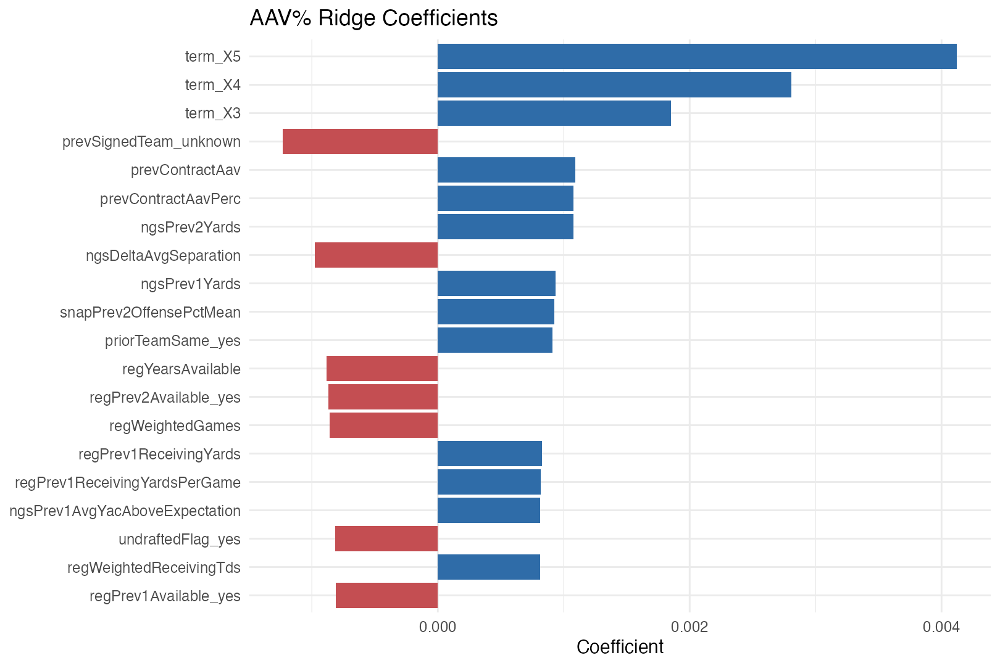

# aavPerc_rl_final

## Purpose

This is the final interpretable `aavPerc` model. It is a ridge-penalized linear regression refit on `train.csv + validate.csv`, again conditioned on a supplied term scenario.

## Why This Model

- Ridge regression gives a fully explicit linear equation and remains stable in the wide, correlated feature space created by the contract recipe.
- Unlike lasso, ridge keeps all predictors in the model, which is useful when several feature families carry overlapping market information.
- This is the audit-friendly companion to the predictive `xgboost` compensation model.

## Final Fit

- Final training rows: `2886`.
- Predictor count after recipe: `504`.
- Selected lambda: `0.00272833`.
- Final fit time: `0.672000` seconds.
- Implied 2026 cap used for dollar translation: `301587302`.
- Saved model object: `models/aavPerc_rl_final.rds`.

## Historical Held-Out Metrics

| metric | value |
| --- | --- |
| rmse | 0.005943 |
| mae | 0.003858 |
| rsq | 0.888613 |

## Closed-Form Structure

The final model is

```text
aavPerc_hat(x) = beta_0 + sum_j beta_j x_j
```

where the `x_j` terms are the recipe-transformed predictors after dummy encoding, missing handling, and normalization. Because the model is ridge-penalized, every transformed predictor keeps a coefficient, but the penalty shrinks unstable estimates toward zero.



Largest absolute coefficients:

| feature | coefficient | absValue |
| --- | --- | --- |
| term_X5 | 0.004123 | 0.004123 |
| term_X4 | 0.002808 | 0.002808 |
| term_X3 | 0.001850 | 0.001850 |
| prevSignedTeam_unknown | -0.001230 | 0.001230 |
| prevContractAav | 0.001094 | 0.001094 |
| prevContractAavPerc | 0.001079 | 0.001079 |
| ngsPrev2Yards | 0.001076 | 0.001076 |
| ngsDeltaAvgSeparation | -0.000977 | 0.000977 |
| ngsPrev1Yards | 0.000937 | 0.000937 |
| snapPrev2OffensePctMean | 0.000926 | 0.000926 |
| priorTeamSame_yes | 0.000908 | 0.000908 |
| regYearsAvailable | -0.000882 | 0.000882 |
| regPrev2Available_yes | -0.000868 | 0.000868 |
| regWeightedGames | -0.000859 | 0.000859 |
| regPrev1ReceivingYards | 0.000828 | 0.000828 |
| regPrev1ReceivingYardsPerGame | 0.000819 | 0.000819 |
| ngsPrev1AvgYacAboveExpectation | 0.000814 | 0.000814 |
| undraftedFlag_yes | -0.000814 | 0.000814 |
| regWeightedReceivingTds | 0.000811 | 0.000811 |
| regPrev1Available_yes | -0.000808 | 0.000808 |
| teamYearsAvailable | 0.000761 | 0.000761 |
| ngsPrev1Receptions | 0.000756 | 0.000756 |
| regPrev2ReceivingTds | 0.000746 | 0.000746 |
| snapPrev2OffenseSnapsPerGame | 0.000734 | 0.000734 |
| regPrev1ReceivingEpa | 0.000733 | 0.000733 |

## Statistical Notes

- Ridge coefficients are not classical p-value-based significance statements. Their interpretation is shrinkage-regularized linear weight on the transformed feature scale.
- Because the recipe normalizes numeric predictors, coefficient size is more comparable across transformed continuous features than it would be on raw units.
- The final prediction remains conditional on the supplied term scenario and is translated into dollars using the implied 2026 cap from the observed 2026 contracts.

## Files

- Model: `models/aavPerc_rl_final.rds`.
- Coefficients CSV: `models/aavPerc_rl_final_coefficients.csv`.
- Coefficient plot: `models/plots/aavPerc_rl_final_coefficients.png`.
