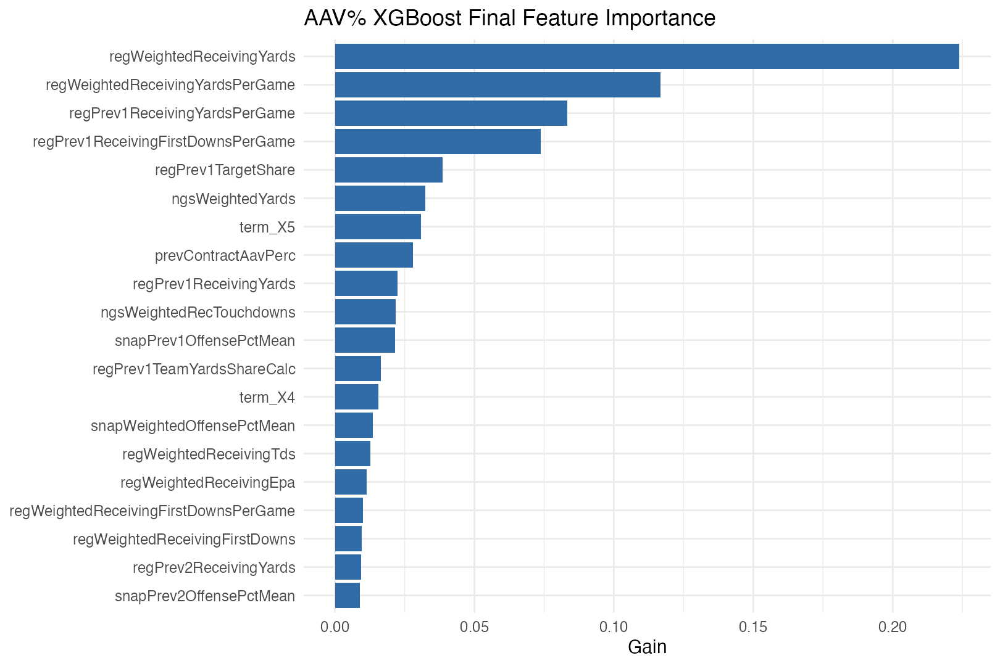

# aavPerc_xgb_final

## Purpose

This is the final predictive `aavPerc` model. It is conditioned on a term scenario, which is the intended production use case for the contract app and the free-agent scoring workflow.

## Why This Model

- It delivered the strongest held-out `aavPerc` accuracy after tuning.
- Boosted trees capture nonlinear effects and interactions among recent production, market context, prior contract history, and the supplied term scenario.
- This is the most predictive conditional compensation model in the project.

## Final Fit

- Final training rows: `2886`.
- Predictor count after recipe: `504`.
- Final fit time: `2.043000` seconds.
- Implied 2026 cap used for dollar translation: `301587302`.
- Saved model object: `models/aavPerc_xgb_final.rds`.

## Selected Hyperparameters

| parameter | value |
| --- | --- |
| mtry | 105 |
| trees | 1352 |
| min_n | 48 |
| tree_depth | 2 |
| learn_rate | 0.075881 |
| loss_reduction | 0.00000107 |
| sample_size | 0.980413 |

## Historical Held-Out Metrics

| metric | value |
| --- | --- |
| rmse | 0.005705 |
| mae | 0.002778 |
| rsq | 0.896643 |

## Interpretation

This model is interpreted through global gain importance. The most important variables are the ones that most consistently improved split quality across the final boosted ensemble, conditional on the supplied term scenario.

Top features by gain:

| Feature | Gain | Cover | Frequency |
| --- | --- | --- | --- |
| regWeightedReceivingYards | 0.223963 | 0.002741 | 0.003163 |
| regWeightedReceivingYardsPerGame | 0.116802 | 0.010244 | 0.008626 |
| regPrev1ReceivingYardsPerGame | 0.083303 | 0.011958 | 0.011501 |
| regPrev1ReceivingFirstDownsPerGame | 0.073844 | 0.002759 | 0.004313 |
| regPrev1TargetShare | 0.038572 | 0.001440 | 0.002013 |
| ngsWeightedYards | 0.032411 | 0.002215 | 0.002588 |
| term_X5 | 0.030905 | 0.014973 | 0.011788 |
| prevContractAavPerc | 0.028052 | 0.016066 | 0.022139 |
| regPrev1ReceivingYards | 0.022533 | 0.002436 | 0.002300 |
| ngsWeightedRecTouchdowns | 0.021757 | 0.006080 | 0.005463 |
| snapPrev1OffensePctMean | 0.021428 | 0.010500 | 0.010063 |
| regPrev1TeamYardsShareCalc | 0.016472 | 0.001673 | 0.001438 |
| term_X4 | 0.015469 | 0.017152 | 0.013514 |
| snapWeightedOffensePctMean | 0.013514 | 0.016240 | 0.014664 |
| regWeightedReceivingTds | 0.012632 | 0.004840 | 0.004600 |
| regWeightedReceivingEpa | 0.011263 | 0.003311 | 0.003450 |
| regWeightedReceivingFirstDownsPerGame | 0.010026 | 0.010729 | 0.010351 |
| regWeightedReceivingFirstDowns | 0.009497 | 0.005880 | 0.005750 |
| regPrev2ReceivingYards | 0.009470 | 0.011488 | 0.010063 |
| snapPrev2OffensePctMean | 0.008842 | 0.010693 | 0.011213 |

## Statistical Notes

- This is a conditional market model, not a one-shot contract model. The supplied term scenario changes the predicted `aavPerc` path.
- Gain importance is global and unsigned. It does not reveal a linear marginal effect in the way a penalized linear model does.
- Predicted dollar AAV is produced by multiplying predicted `aavPerc` by the implied 2026 cap from the labeled 2026 contracts.

## Files

- Model: `models/aavPerc_xgb_final.rds`.
- Importance CSV: `models/aavPerc_xgb_final_importance.csv`.
- Importance plot: `models/plots/aavPerc_xgb_final_importance.png`.
