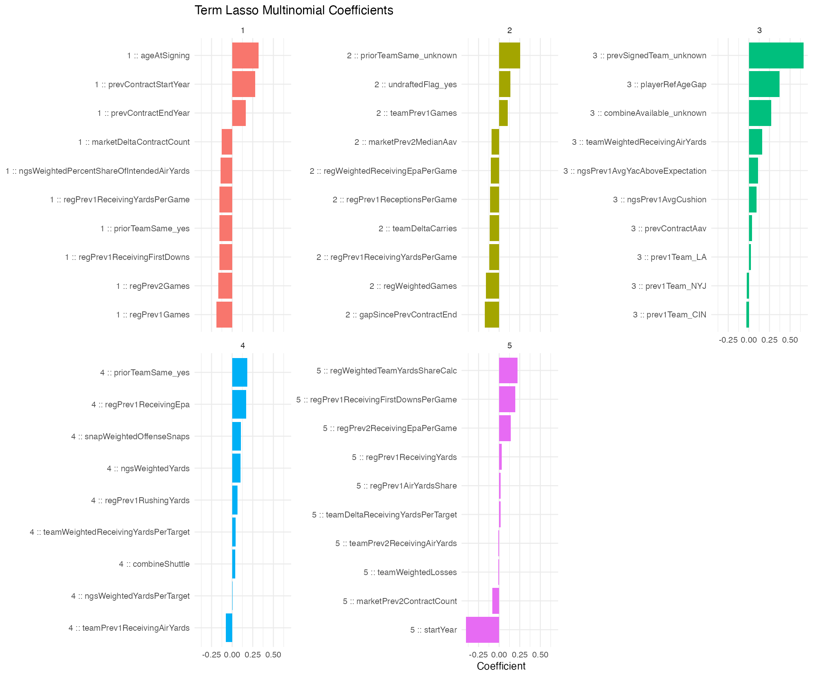

# term_ll_final

## Purpose

This is the final interpretable term model. It is a lasso-penalized multinomial logistic regression refit on `train.csv + validate.csv` using the lambda that was selected by grouped cross-validation on the original training split.

## Why This Model

- The multinomial lasso is materially more interpretable than boosted trees because it has an explicit softmax form with a finite coefficient vector for each term class.
- The lasso penalty performs embedded variable selection, which is useful in this very wide engineered design.
- This model is the right audit companion to the stronger but less transparent `xgboost` classifier.

## Final Fit

- Final training rows: `2886`.
- Predictor count after recipe: `500`.
- Selected lambda: `0.00888624`.
- Final fit time: `24.343000` seconds.
- Saved model object: `models/term_ll_final.rds`.

## Historical Held-Out Metrics

| metric | value |
| --- | --- |
| mnLogLoss | 0.591975 |
| rocAuc | 0.642260 |
| brier | 0.060119 |
| accuracy | 0.813187 |

## Closed-Form Structure

For each term class `k` in `{1, 2, 3, 4, 5+}`, the model defines a linear score

```text
eta_k(x) = beta_0k + sum_j beta_jk x_j
P(term = k | x) = exp(eta_k(x)) / sum_m exp(eta_m(x))
```

The `x_j` terms are the recipe-transformed predictors after dummy encoding, missing-data handling, and normalization. So the exact closed form exists, but it is written on the transformed feature space rather than the raw CSV columns directly.

## Sparsity

The table below counts how many non-zero coefficients remain in each class-specific linear predictor after lasso shrinkage.

| class | nonZeroCoefficients |
| --- | --- |
| 1 | 67 |
| 2 | 45 |
| 3 | 22 |
| 4 | 9 |
| 5 | 13 |



Top non-zero coefficients by class:

| class | feature | coefficient |
| --- | --- | --- |
| 1 | ageAtSigning | 0.319401 |
| 1 | prevContractStartYear | 0.281003 |
| 1 | regPrev1Games | -0.189182 |
| 1 | prevContractEndYear | 0.166684 |
| 1 | regPrev2Games | -0.165959 |
| 1 | regPrev1ReceivingFirstDowns | -0.156533 |
| 1 | priorTeamSame_yes | -0.156230 |
| 1 | regPrev1ReceivingYardsPerGame | -0.152842 |
| 1 | ngsWeightedPercentShareOfIntendedAirYards | -0.141583 |
| 1 | marketDeltaContractCount | -0.127513 |
| 2 | priorTeamSame_unknown | 0.253435 |
| 2 | gapSincePrevContractEnd | -0.176657 |
| 2 | regWeightedGames | -0.161586 |
| 2 | undraftedFlag_yes | 0.136725 |
| 2 | regPrev1ReceivingYardsPerGame | -0.121677 |
| 2 | teamDeltaCarries | -0.113340 |
| 2 | regPrev1ReceptionsPerGame | -0.111664 |
| 2 | teamPrev1Games | 0.106104 |
| 2 | regWeightedReceivingEpaPerGame | -0.103512 |
| 2 | marketPrev2MedianAav | -0.094084 |
| 3 | prevSignedTeam_unknown | 0.662303 |
| 3 | playerRefAgeGap | 0.371524 |
| 3 | combineAvailable_unknown | 0.268991 |
| 3 | teamWeightedReceivingAirYards | 0.160968 |
| 3 | ngsPrev1AvgYacAboveExpectation | 0.110078 |
| 3 | ngsPrev1AvgCushion | 0.094768 |
| 3 | prevContractAav | 0.036554 |
| 3 | prev1Team_CIN | -0.030393 |
| 3 | prev1Team_NYJ | -0.026909 |
| 3 | prev1Team_LA | 0.026707 |
| 4 | priorTeamSame_yes | 0.182645 |
| 4 | regPrev1ReceivingEpa | 0.168645 |
| 4 | snapWeightedOffenseSnaps | 0.103965 |
| 4 | ngsWeightedYards | 0.101870 |
| 4 | teamPrev1ReceivingAirYards | -0.078024 |
| 4 | regPrev1RushingYards | 0.064912 |
| 4 | teamWeightedReceivingYardsPerTarget | 0.042766 |
| 4 | combineShuttle | 0.035723 |
| 4 | ngsWeightedYardsPerTarget | 0.003551 |
| 5 | startYear | -0.403345 |
| 5 | regWeightedTeamYardsShareCalc | 0.221213 |
| 5 | regPrev1ReceivingFirstDownsPerGame | 0.195917 |
| 5 | regPrev2ReceivingEpaPerGame | 0.140007 |
| 5 | marketPrev2ContractCount | -0.085287 |
| 5 | regPrev1ReceivingYards | 0.029621 |
| 5 | regPrev1AirYardsShare | 0.019365 |
| 5 | teamDeltaReceivingYardsPerTarget | 0.017578 |
| 5 | teamWeightedLosses | -0.011895 |
| 5 | teamPrev2ReceivingAirYards | -0.011439 |

## Statistical Notes

- Coefficients here should be interpreted as penalized partial associations on the transformed feature space, not as unbiased frequentist estimates with p-values.
- A non-zero coefficient is the practical notion of “significant” in this model family because lasso explicitly zeroes many weaker terms out.
- Classwise coefficient signs affect the relative linear score for that class and therefore the softmax probability, holding all other transformed features fixed.

## Files

- Model: `models/term_ll_final.rds`.
- Coefficients CSV: `models/term_ll_final_coefficients.csv`.
- Coefficient plot: `models/plots/term_ll_final_coefficients.png`.
