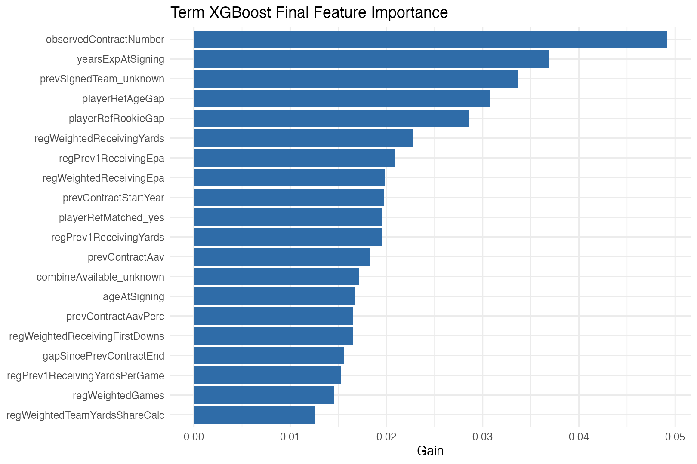

# term_xgb_final

## Purpose

This is the final predictive term model. Hyperparameters were selected on `train.csv` only, with grouped cross-validation and a single 2026 validation check, and the model is now refit once on `train.csv + validate.csv` so it can score the unsigned 2026 free agents.

## Why This Model

- `xgboost` was the strongest held-out term model on proper scoring rules after tuning.
- Tree boosting is the better choice here when the target is a sparse, nonlinear multinomial contract outcome with many engineered interactions and missingness indicators.
- This model is not closed form, so it is paired with a more interpretable penalized multinomial logit elsewhere.

## Final Fit

- Final training rows: `2886`.
- Predictor count after recipe: `500`.
- Final fit time: `15.661000` seconds.
- Saved model object: `models/term_xgb_final.rds`.

## Selected Hyperparameters

| parameter | value |
| --- | --- |
| mtry | 92 |
| trees | 1251 |
| min_n | 10 |
| tree_depth | 4 |
| learn_rate | 0.005249 |
| loss_reduction | 0.00016009 |
| sample_size | 0.945583 |

## Historical Held-Out Metrics

These are the 2026 validation metrics from the tuning stage. They are the honest out-of-sample numbers that justified the final refit.

| metric | value |
| --- | --- |
| mnLogLoss | 0.536581 |
| rocAuc | 0.674789 |
| brier | 0.056768 |
| accuracy | 0.824176 |

## Interpretation

This model should be interpreted through global feature importance, not through a single signed linear coefficient. Gain-based importance shows which engineered inputs most often contributed the most impurity reduction across the fitted trees.

Top features by gain:

| Feature | Gain | Cover | Frequency |
| --- | --- | --- | --- |
| observedContractNumber | 0.049144 | 0.025958 | 0.019085 |
| yearsExpAtSigning | 0.036833 | 0.027215 | 0.021227 |
| prevSignedTeam_unknown | 0.033701 | 0.011277 | 0.007076 |
| playerRefAgeGap | 0.030770 | 0.017841 | 0.014247 |
| playerRefRookieGap | 0.028581 | 0.020873 | 0.017746 |
| regWeightedReceivingYards | 0.022760 | 0.005239 | 0.006712 |
| regPrev1ReceivingEpa | 0.020950 | 0.012870 | 0.007783 |
| regWeightedReceivingEpa | 0.019812 | 0.008418 | 0.009064 |
| prevContractStartYear | 0.019789 | 0.015504 | 0.010632 |
| playerRefMatched_yes | 0.019609 | 0.007606 | 0.005010 |
| regPrev1ReceivingYards | 0.019538 | 0.010528 | 0.005354 |
| prevContractAav | 0.018256 | 0.016403 | 0.017058 |
| combineAvailable_unknown | 0.017187 | 0.008800 | 0.005374 |
| ageAtSigning | 0.016675 | 0.024652 | 0.016905 |
| prevContractAavPerc | 0.016507 | 0.017578 | 0.019066 |
| regWeightedReceivingFirstDowns | 0.016493 | 0.003814 | 0.005240 |
| gapSincePrevContractEnd | 0.015619 | 0.026425 | 0.015069 |
| regPrev1ReceivingYardsPerGame | 0.015320 | 0.008128 | 0.006158 |
| regWeightedGames | 0.014535 | 0.015443 | 0.009217 |
| regWeightedTeamYardsShareCalc | 0.012608 | 0.003297 | 0.003652 |

## Statistical Notes

- Importance is directional only in the sense of relevance. It does not tell you whether a larger feature value increases or decreases a specific term class probability.
- Importance is not a causal claim. It reflects the final boosted ensemble after the recipe transformations, dummy encoding, missing-value handling, and normalization.
- Because the term problem is multiclass and imbalanced, the key validation metric remains multinomial log loss rather than raw accuracy.

## Files

- Model: `models/term_xgb_final.rds`.
- Importance CSV: `models/term_xgb_final_importance.csv`.
- Importance plot: `models/plots/term_xgb_final_importance.png`.
